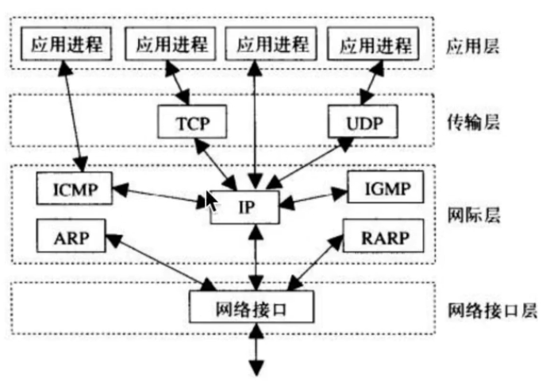
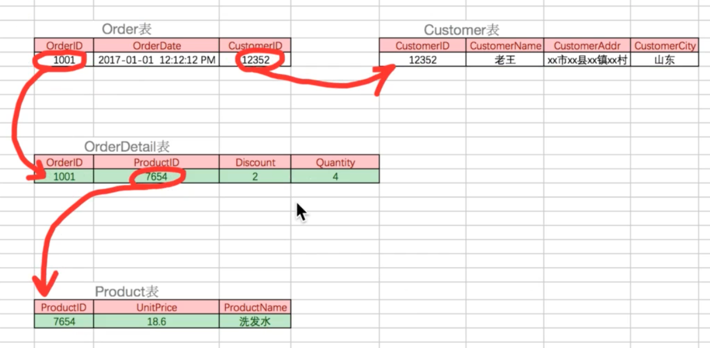

# 2019暑假自习笔记

#### g++操作

* 静态链接库的生成`add_library(aaa STATIC 源文件)`  生成libaaa.a
* 动态链接库的生成`add_library(aaa SHARED 源文件)`或`g++ aaa.cpp -shared -o libaaa.so`  生成libaaa.so
* 静态链接库使用`g++ main.c libaaa.a -I include -o outcome`
* 动态链接库使用`g++ main.c -I include -L. -laaa.so -o outcome`

#### CMakeLists常用操作

> 个人理解CMakeList做的主要工作就是指定源文件/头文件/链接库的目录，相当于暂时指定了一系列环境变量
>
> CmakeLists 中的变量只有字符串和LIST类型（字符串的LIST），注释用#。

* 指定最小版本: `cmake_minimum_required(VERSION X.X)`

* find_package(aaa REQUIRED) : 在一些环境变量指定的路径下搜索aaa.cmake，然后将其include以拿到一些变量。

* print:  `message(string ${VAR})`

* 变量引用: `${VAR}`

* 设置项目名称: `project(name)`

  > 该命令会引入name_BINARY_DIR 和 name_SOURCE_DIR。
  >
  > 其中name_BINARY_DIR为CMakeLists根目录/build, name_SOURCE_DIR为CMakeLists根目录

* 拿取路径下的所有源文件，存为变量SRCS: `aux_source_directory(. SRCS)`

* 将头文件目录引入: `include_directories(include)`

* 将子目录下的CMakeLists加入此处: `include_directories(subdir)`

* 将SRCS中的源文件生成可执行文件name: `add_executable(name ${SRCS})`

* 将LIB_SRCS中的源文件生成库文件libaaa.so/libaaa.a: `add_library(aaa SHARED/STATIC ${LIBS_SRCS})`

  > 若不加SHARED或STATIC，会默认生成静态链接库。

* 为可执行文件name添加动态/静态链接库libaaa.so/libaaa.a: `target_link_libraries(name aaa)`

* 另外有一个link_libraries() 的命令，用在add_executable/add_library之前，作用和target_link_libraries相同，同类命令link_directories() ，指定到库的路径而不是库本身

#### Gazebo

> Solidworks相关操作
>
> [sw_urdf_exporter](http://wiki.ros.org/sw_urdf_exporter) 按其中2.1安装即可，装好后插件在SW -> 工具 -> File -> Export as URDF
>
> 生成urdf过程中只需要设置link和axis，其中子link的基座标系就是它与父link间joint的坐标系，若为旋转其转轴为Z轴，方向按右手确定。

1. [URDF与Gazebo](http://gazebosim.org/tutorials?tut=ros_urdf&cat=connect_ros)

   URDF (Universal Robotic Description Format) 和SDF (Simulation Description Format) 均可以用于机器人的描述，但URDF会缺少一些Gazebo需要的属性，故应在其中加入gazebo元素<gazebo>

   XACRO(XML Macros)可为URDF提供宏定义的功能，以方便编写。工作流程为：XACRO -> URDF -> SDF 其中第一步由xacro包下xacro.py程序完成，将带宏定义的XACRO解析成URDF，第二步由Gazebo完成，将带<gazebo>元素的URDF解析成SDF，可用`gz sdf -p aaa.urdf`检验urdf是否可以正常解析。

   可通过设置<joint>元素中的<limit>子元素的effort和velocity属性限制最大转矩和速度。

2. [Gazebo插件如摄像头和激光雷达的使用](http://gazebosim.org/tutorials?tut=ros_gzplugins&cat=connect_ros)

   可参考rrbot_description/urdf/rrbot.gazebo 

3. [Gazebo中关节电机控制](http://gazebosim.org/tutorials?tut=ros_control&cat=connect_ros)

   简单总结四个必要环节：

   1. urdf中的gazebo_ros_control插件

   2. urdf中的transmission元素。

   ​    其内部<joint>元素下的子元素<hardwareInterface>有Effort/Velocity/PositionJointInterface三种可用, 应与yaml中相应关节控制器种类匹配

   3. yaml文件。

   ​    其可选控制器种类有(可通过rosservice call controller_manager/list_controller_types得到)

   ```
   effort_controllers:  力/力矩控制，需设置PID，单位N N/m，PID可通过测试调节至合理值
   	joint_effort_controller
   	joint_group_effort_controller
   	joint_position_controller
   	joint_group_position_controller
   	joint_velocity_controller
   joint_state_controller:  读取各关节当前位置，使gazebo向joint_state话题上发布关节信息
   	joint_state_controller
   position_controllers:  位置控制，单位rad，不设置PID会瞬移，设置后和力控制表现相近，官方教程未设置
   	joint_position_controller
   	joint_group_position_controller
   以及一个特殊的diff_drive_controller/DiffDriveController对应VelocityJointInterface
   ```

   4. controller_spawner。

4. URDF的构建逻辑

   坐标系间的关系靠<joint>中的<origin>元素维护，<link>内的<origin>描述其自身相对于由<joint>定义好的坐标系的变换情况，一般为0，其中inertial内的origin描述质心。

5. 对于造型较为复杂的模型，可能导入gazebo过程中会出现各种诡异的问题，一般是由于惯性张量引起的，经尝试在每一项惯性张量前加上个1*可解决问题，但原理不明

6. 可调节link<gazebo>标签中的kp属性来降低其刚性

7. 可通过gazebo/link_states及gazebo/model_states拿到每个link和model在世界坐标系下的位姿

8. .world文件中的include url是从环境变量GAZEBO_MODEL_PATH所指路径中读取config文件拿取model，这个model也有其对应的sdf文件，整个模型文件夹可通过在gazebo内使用模型编辑功能导入stl或dae生成

> gazebo-ros仿真基本流程
>
> 1. 启动gazebo(gzserver和gzclient)
>
> ```xml
> <include file="$(find gazebo_ros)/launch/empty_world.launch">
> ```
>
> 2. 将urdf文件送入参数robot_description
>
> ```xml
> <param name="robot_description" command="$(find xacro)/xacro.py $(arg model)" />
> ```
>
> 3. 用spawn_model程序将模型导入gazebo
>
> ```xml
> <node name="urdf_spawner" pkg="gazebo_ros" type="spawn_model"
>      args="-z 1.0 -urdf -model robot_name -param robot_description" output="screen" />
> 除了-param也可以-file urdf路径
> ```
>
> 4. 将ros_control相关的yaml文件读入参数服务器
>
> ```xml
> <rosparam file="$(find sw2urdf_trial)/config/sw2urdf_trial.yaml" command="load"/>
> ```
>
> 5. 用controller_spawner将控制器导入,args为各个控制器的参数名
>
> ```xml
> <node name="controller_spawner" pkg="controller_manager" type="spawner" 
> 	output="screen" ns="sw2urdf_trial" args="joint_state_controller
>                    joint1_pos_controller
>                    joint2_pos_controller
> 				   joint3_pos_controller"/>
> ```
>
> 6. 开启robot_state_publisher来发布tf(其通过拿取robot_description参数和订阅joint_state计算tf)
>
> ```xml
> <node pkg="robot_state_publisher" type="robot_state_publisher"  name="robot_state_publisher">
> ```
>
> 7. 有了robot_description和tf，才可以开rviz查看
>
> ```xml
> <node name="rviz" pkg="rviz" type="rviz" args="$(find sw2urdf_trial)/rviz/urdf.rviz" />
> ```
>

### GFW与反制原理个人理解

常用的网络通讯，基于TCP或UDP协议，用IP对应到主机，用端口号对应到程序*(如网站的服务器和浏览器端口号默认为80)*。而GFW的实现的主要逻辑是阻止对某个预设IP的访问，实现方式主要有：

1. DNS劫持，DNS污染

   > 这两种方式实现原理都是在用户想访问某个域名时，会首先向DNS服务器查询域名以询问其对应的IP地址，此时若通过某种手段向用户返回一个错误的IP地址，就导致用户不可通过域名访问某网站。
   >
   > 这种方式可通过修改HOSTS文件反制，即不通过DNS服务器直接拿取IP。

2. IP封锁

   > 防火墙接收到访问请求时，直接与维护的IP黑名单进行对照，若在黑名单内则直接丢弃数据包。
   >
   > 这种方法只能通过创建一个虚拟局域网(VPN)，或在没被IP封锁的VPS服务器上运行代理程序来实现。

vpn、vps、shadowsocks的简单理解：

> **vpn**（**Virtual Private Network**）虚拟专用网络，也可称为虚拟局域网。其常规用途为创建一个虚拟的局域网，让不在同一个交换机下的各个主机可以在同一个虚拟局域网下通讯。基本应用有学校/公司在其外部接入内部局域网、局域网联机游戏的对战平台等，都是对vpn的应用。
>
> **vps**（**Virtual Private Server**）虚拟专用服务器，一般为供应商在一台专用服务器上创建出多台虚拟子服务器，并将子服务器提供给用户。可用于建站，翻墙等操作。
>
> 进行虚拟局域网的实际工作时，vpn分为客户端和服务器，客户端创建出一个虚拟网卡，向服务器请求一个虚拟的内网ip，然后服务器根据分配的这些内网ip进行协调，模拟出局域网的功能。
>
> 翻墙时，客户端程序将原本的数据包加装一层IP协议，将源IP设置为虚拟网卡，目标IP设置为vpn服务器；服务器端程序会剥离掉加装的IP头，然后代替原主机进行访问，并将收到的回复数据包返回给原主机。可理解为客户端主机被虚拟为海外某局域网内的一台主机，以实现翻墙。
>
> **Shadowsocks**（简称**SS**）是一种基于Socks5代理方式的加密传输协议，其软件分为local和server，即客户端的本地代理和服务器。网络通讯时，浏览器向本地代理进行一次基于sock5协议的通讯，local程序将请求加密后发给server，server解密后对目标ip发送正常的tcp请求，收到回复后加密发回local，再返回给浏览器。

可见，翻墙的核心原理是通过一台**没有被加入GFW IP黑名单的，且访问目标IP不需要经过GFW**的海外服务器，对数据包进行中介转发，并将回复数据传回。

#### Can（Controller Area Network）详解

> 最早用于汽车行业，为减少线数，保证可靠地高速通讯，用差分电平提高稳定性，40M内速率可达1M

* 显性电平：CAN_H和CAN_L相差2.5V左右，只要有一个节点输出显性，总线即为显性，代表逻辑0
* 隐性电平：相差0V，必须所有节点均输出隐形才为隐性，代表逻辑1
* 帧类型：

| 帧类型         | 帧用途                             |
| -------------- | ---------------------------------- |
| 数据帧         | 发送单元向接收单元传送数据         |
| 遥控帧(远程帧) | 接收单元向相同ID的发送单元请求数据 |
| 错误帧         | 检测出错误时向其他单元通知错误     |
| 过载帧         | 接收单元通知其尚未做好接收准备     |
| 间隔帧         | 将数据帧和遥控帧与前面的帧分开     |

> 另外数据帧和遥控帧还可以分为标准和扩展两种格式，标准格式仲裁位(ID)有11位，扩展格式ID有29位。

下面详细介绍数据帧，一个CAN数据帧分为几个部分：

	1. 帧起始：一个位的显性电平表示起始
 	2. 仲裁段：表示数据优先级，标准帧11位，拓展帧29位
     * 内部的RTR段表示是否是远程帧，0数据，1远程
 	3. 控制段：表示数据段的字节数
     * DLC表示为数据段长度，有效值为0-8
	4. 数据段：8个字节的数据
	5. CRC段：用于检查帧传输错误，根据前四个段的数据计算CRC值用于校准
	6. ACK段：用于确认是否正常接收，发送时置ACK Slot为隐性，接收节点正常接收后将其置为显性
	7. 帧结束：连续7个隐性位表示帧结束


#### Python

* 成熟的设计应保证程序完成后不需要进入改动，可将必须的配置参数存入配置文件，在配置文件中进行更改
* python文件读写可以用f = open(filepath, 'r'/'w'/'a')，也可以用with open(filepath, 'r'/'w'/'a') as f :  区别是后者不需要f.close()

- python读取命令行参数可以用sys.argv[]，也可以用argparse模块，后者较标准，可以产生-h。

  ```python
  import argparse
  parser = argparse.ArgumentParser()  # 拿取解析器实例
  parser.description = "Search string recursively in folder"
  parser.add_argument("Path", help="Search path", type=str)  # 添加参数和帮助说明
  parser.add_argument("String", help="Object string", type=str)
  args = parser.parse_args()  # 拿取输入参数
  if len(sys.argv) != 3:
      parser.print_help()  # 打印帮助信息
      sys.exit(1)
  print(args.Path,args.String)  # 调用参数
  ```

- python的字典3.5之前是无序的，3.6之后为有序

- print小技巧: \r回车与end=""取消末尾自动换行可起到同行不断刷新的效果(only in python3)

  ```python
  print("/rDownloading:{:.2f}".format(download_rate), end="")
  ```

- isinstance(obj, class)  判断obj是否是class的实例或继承自class(功能包括但不仅限于此)

  > 例如如果自己定义一个类并加入\__iter__方法，则isinstance(obj, Iterable)将会返回True。但此时obj并未继承Iterable

- dir(obj): 返回包括obj及其继承的所有的属性和方法的 list

- obj.\__dict__: 返回包括obj自身所有属性的字典(不包括继承的属性)

- \__getitem__方法用于使对象能使用obj[0]

- python中类属性，实例属性，类方法，实例方法，静态方法的区别和应用场景：理论上说，从节省资源的角度，可将与类无关的方法用静态方法实现; 将与每个实例都相同的方法和属性用类方法和类属性实现; 每个实例差异化的方法和属性用实例属性和实例方法实现

- python中列表推导式的使用技巧

- 关于单双引号，习惯上长段双引号，短段单引号; docstring三双引号，较短时可写成单行。

- pop, del, remove：pop和del都是针对索引，remove针对内容; pop返回内容，del无返回

- 关于import的二三事

  > 1. import的默认路径可在sys.path中找到。可使用sys.path.append()加入新路径
  > 2. import aaa时，会直接将aaa当作模块名，也就是说无法使用变量aaa存储模块名进行导入
  > 3. 若想使用aaa='model_name'进行import，可使用\__import__(aaa)，输入为字符串，返回为模块实例
  > 4. 在成功import的情况下，多次import只有第一次会有效，所以修改文件后在交互界面再次import时无法更新。 若想重新导入需要使用`from imp import reload`, `reload(module)`来重新导入

- 关于python中的eval(source, globals=None, locals=None)    evalute

  > 用于将一个字符串source转化成有效的表达式，包括变量，函数，列表/字典等，功能十分强大
  >
  > e.g: eval("os.system('clear')")执行系统命令	eval("func_name")()执行函数
  >
  > ​	   eval("{'a': 1,'b': 2,'c': 3}")返回一个字典，可用于将配置文件写成字典格式，读入后用eval处理
  >
  > 但由于其可以调用系统命令，故使用时需要注意安全
  
- 关于python函数传入参数的二三事

  > 传入参数有四种，包括必选参数，默认参数，可变参数，关键字参数
  >
  > def fun(a, b=1, *args, **kwargs): 
  >
  > a: 必选参数
  >
  > b: 默认参数，可缺省以使用默认值1，也可用fun(1, b=2)指定为新值
  >
  > *args: 可变参数，如11, 22, 33等会以元组形式存入args。调用: args[index]
  >
  > **kwargs: 关键字参数，如arg1 = 11, arg2 = 22的参数会以字典的形式存入kwargs。调用: kwargs[key]
  >
  > Ps: 在函数内部的其他函数的传入参数中使用*args或**kwargs表示拆包，即将元组/字典变回其输入时原来的样子
  
- 匿名函数：无函数名，直接返回引用的简单函数，用于暂时实现简单功能

  ```python
  # 引用 = lambda 参数: 返回值
  cal_dis = lambda p1,p2: sqrt( (p1[0]-p2[0])**2 + (p1[1]-p2[1])**2 )  # 计算两点间距离
  cal_dis([1,1], [2,2])  # 1.41421
  ```

#### 杂记

* find命令用法 ： find [路径] [特征] 	e.g : `find / -name "rostopic" | less`

* roslaunch中的一些细节

  args意义 ： shell中命令后附加参数    e.g:

  ```xml
    <node
      name="spawn_model"
      pkg="gazebo_ros"
      type="spawn_model"
      args="-file $(find maxliebao)/robots/maxliebao.urdf -urdf -model maxliebao"
      output="screen" />
  上述语句等价与在shell中运行
  rosrun gazebo_ros spawn_model.py -file maxliebao根目录/robots/......
  ```

  respawn="true"的意义：节点停止时launch会重新启动该节点

  required="true"的意义：该节点停止时launch会关闭其他节点

  ns="aaa"的意义：该节点名称及其创建的话题和服务名称会变成aaa/...

  node元素内部<remap from="aaa" to="bbb" />的意义： 将节点及话题服务名称中的aaa替换为bbb, (包括发布和接收)

  command的意义： 拿取shell命令的输出    e.g:

  ``` xml
    <param name="robot_description" command="$(find xacro)/xacro --inorder '$(find rrbot_description)/urdf/rrbot.xacro'" />
  上述语句用xacro包下的xacro程序将rrbot_description包下的rrbot.xacro解析成URDF并存在rrbot_description这一参数上
  ```

* vim中寄存器常用的为`无名寄存器""`,`系统剪贴板"+`,输入模式下可用<C+r>加寄存器号调用其内容

* vim映射设置中回车用<CR>,tab用<Tab>,<Leader>键默认为反斜杠`\`

* 原子操作：不可分割的，一旦开始必须完全完成的操作

* 终端快捷键

  > C-a 开头	C-e 结尾	C-f 前一	C-b 后一	C-w 删前面	C-k 删后面

* vim normal模式下D删至行尾，d0删至行首

* linux下的软/硬链接

  ```shell
  ln file hard  # 硬链接，创建与file拥有相同inode的文件hard，指向硬盘中相同的位置
  ln -s file soft  # 软链接，创建具有不同inode的新文件soft，存储了file的绝对路径
  ```

* Linux文件描述符file description

  * 标准输入 1    标准输出 2    错误输出 3
  * 单个进程只能打开一定数量的文件，可通过/proc/[PID]/limits查看, [PID]为进程ID号
  
* ```shell
  使push时不用每次都输入密码，具体原理有待深入研究
  git config --global credential.helper store
  ```

* linux后台运行且不随终端关闭而关闭：`nohup command&` (no hangup不挂断)

* `F5`和`Ctrl+R`的区别：F5刷新可能会使用浏览器的缓存内容，可能不是真的重新向服务器发送请求。Ctrl+R则是真正的重新向服务器发送请求的刷新。

* Nvidia独显驱动安装

  ```
  https://linuxconfig.org/how-to-install-the-nvidia-drivers-on-ubuntu-18-04-bionic-beaver-linux
  按上网站方法一配置后重启时在perform mok management界面选择enroll mok
  ```

* ubuntu安装的坑

  > 注意区别硬盘引导方式是传统的Legacy还是UEFI，这关系到手动分区时引导方式的选择
  >
  > 另外两系统是否在一个硬盘上关系到启动引导方式能不能放在一起，若分别在两个硬盘上，可通过在BIOS中更改启动优先级选择系统

* 修改grub

  ```shell
  sudo vim /etc/default/grub
  sudo update-grub
  ```
  
* Windows下Linux环境模拟

  > cygwin+zsh(我的会卡)+tmux(terminator没找到怎么用,而且tmux的配置文件不生效)
  >
  > 根目录/为安装cygwin时设定的根路径，不可操作除根路径下子路径以外的东西


# 课程笔记

### 01网络编程

* ip地址，ABCDE类，网络号，主机号
* 子网掩码：用于确定网络号和主机号
* 私网ip范围`10.0.0.0 ~ 10.255.255.255(A类)  172.16.0.0~172.31.255.255(B类)  192.168.0.0~192.168.255.255(C类)` 用于组建不同规模的局域网
* 端口1024以下为知名端口，不可随意使用（80HTTP，21FTP），1024到65535为动态端口
* socket套接字，进程间通讯的一种方式，可用于不同主机间进程的通讯
* windows默认编码格式gbk
* udp，tcp区别和各自机制，udp像信件，较简单，不区分客户端和服务器;
* tcp像电话，更稳定，区分客户端和服务器，服务器必须绑定port，客户端一般不绑定
* 客户端/服务器在调用close()时，对方的recv也能接到数据，为空数据，可用于判断客户端是否断开

### 02多任务

* 并行和并发的概念，并行多核同步进行，并发单核轮流处理

#### 线程

* 线程可理解为对当前执行代码位置的一个指针，多线程即可理解为同时指向并执行多个代码行

* 主线程结束，程序才会结束，若有未跑完的子线程，主线程会等待其结束

* 多线程间共享全局变量，但若多线程同时修改一个全局变量，可能会出现冲突

* 为解决冲突问题，完成多线程协作，可使用互斥锁(mutex)机制让一些线程在特定位置阻塞，防止其同时修改全局变量

* 死锁的概念：两个互斥锁都阻塞在等待对方解锁的位置而导致程序卡死，解决方式：超时检测，银行家算法等

  ``` python
  ThreadA(threading.Thread):
      def run(self):
  		mutexA.acquire()
  		time.sleep(1)
  		mutexB.acquire()
  ThreadB(threading.Thread):
  	def run(self):
      	mutexB.acquire()
  		time.sleep()
  		mutexA.acquire()
  ```

#### 进程

* 运行起来的，占用一定资源的程序称为进程(Process)
* python中每次开启子进程，都会copy一份与主进程一致的资源
* 相对于进程，线程执行开销较小，可轻量地实现多任务，但不利于资源的管理和保护，进程则相反。一般而言会选择使用线程实现多任务
* 进程间不共享全局变量，通讯可用multiprocessing.Queue
* 进程池：创建一个限制最多同时运行进程数的进程池，可向其中无限添加任务，顺序运行
* 进程池中子进程抛出异常，不会显示在终端中

#### 协程

> 迭代器和生成器主要用于降低大量数据对资源的占用，如xrange和range，当数据量很大时，xrange要所占用的资源要远小于range

* 迭代器：能被for _ in obj:遍历的对象称为可迭代的对象，若想使一个对象成为可迭代的对象，须在其中实现`__iter__`方法，该方法应该返回一个迭代器，迭代器是一个至少实现了`__iter__`和`__next__`方法的对象，每次for in: 都会调用一次`__next__`方法, 将其返回值给_

* list(), tuple()等转换也是通过迭代器实现的

* 生成器：生成器是一种特殊的迭代器，也可理解成让一个函数变得可暂停

  1. 将列表生成式的[]换成()则产生一个生成器。 e.g: (_ for _ in range(10))

  2. 若一个函数中有yield语句，则调用该函数变为返回一个生成器的对象obj

     每次调用next(obj)时函数运行到yield处，并返回yield后内容，然后暂停。再次调用next(obj)继续运行至下次yield，返回，暂停，直至函数结束，抛出StopIteration异常

     除了next(obj)，也可以用obj.send(send_msg)实现激活生成器，并传入参数。但send不能在第一次激活生成器时使用, 因为第一次激活时函数从第一行运行，没有send_msg = yield rtn接数据

* 协程即为利用yield机制使多任务通过暂停的方式同步进行，占用资源比线程更少，但用yield实现时遇到阻塞任务时会全部阻塞，故一般使用gevent模块实现协程，gevent对yield机制进行了封装，实现将单任务阻塞的等待时间利用起来去执行其他任务。但协程归根结底还是在单线程下运行。

​        总结：由于GIL的影响，如果使用Cpython的解释器，则协程和线程实际上都是并发执行，也都能共享全局变量和类属性。但由于协程是使用yield机制实现的并发，故其在代码层级保证了同时修改一个变量时不会出问题，而线程的并发是在CPU层级由GIL实现的，故若要想保证同时修改一个变量时不会出问题，还需要手动加锁。故我认为，对于非计算密集型的多任务，若需多任务间通讯，使用协程会方便一些; 若不需通讯，则都行(经简单测试多线程好像相比gevent模块实现协程要快一些)。若对于计算密集型多任务，则最好使用进程，才能真正实现并发，充分利用多核CPU性能。

### 03 web服务器

#### 正则匹配

```
单个：
	[]：匹配单个在一定范围内的字符 e.g:[0-9a-zA-Z_]
	[^]:匹配单个非xxx的字符 e.g:[^0-9a-z]{2,5} 二到五个非0-9也非a-z的字符
	\d：匹配数字
	\D：匹配非数字
	\s：匹配空白，空格/tab
	\S：匹配非空白
	\w：匹配单词，a-z/A-Z/0-9/_/中文等各语言
	\W：匹配非单词
	. ：匹配任意，除了\n，如果想匹配\n可用match(r".", "\n", re.S)
多个：
	* ：匹配前一个字符出现任意次
	+ ：匹配前一个字符出现大于0的任意次
	？ ：匹配前一个字符出现0或1次，即可有可无
	{n}：匹配前一个字符出现n次
	{m, n}：匹配前一个字符出现m到n次
其他：
	^：匹配开头
	$：匹配结尾
	(aaa|bbb)：或逻辑
	()：取正则中的部分结果    rst = re.match()    rst.group(1)
	\n：第n个分组中的值
```

re.match(表达式，匹配内容，flag)，从头开始匹配，只能返回第一个匹配结果，返回值为一个Match实例

re.search()与match相同，仅仅是非从头匹配，只能返回第一个匹配结果，返回值为一个Match实例

re.findall()，非从头匹配，返回值为匹配结果的列表

re.sub(表达式，替换内容，匹配内容)，匹配并替换，可以匹配多个结果。替换内容可为函数的引用，示例如下：

```
def add(temp):
	Strnum = temp.group()
	num = int(Strnum) + 1
	return str(num)
re.sub(r'\d+', add, "python = 996")
返回值为替换后的字符串
```

re.split()，以匹配结果为界切片，示例如下：

```
re.split(r':| ', "info:aaa bbb ccc")
返回值：['info', 'aaa', 'bbb', 'ccc']
```

#### HTTP协议

* 浏览器客户端和服务器tcp通讯的发送的数据格式

* tcp的三次握手，四次挥手

  * syn表示请求，ack表示应答

  * 三次握手指客户端调connect时客户端和服务器间的三次请求和应答

  * 四次挥手指客户端或服务器调用close时相互发送的四次数据包，用以释放资源

  * 四次挥手时先调用close的一方会保留资源2到5分钟，在此期间端口会被占用，若想服务器先close的情况下四次挥手后资源能够立即释放，可加入代码如下：

    ```python
    server_socket.setsockopt(socket.SOL_SOCKET, socket.SO_REUSEADDR, 1)
    ```

* 简单实现http协议的web服务器demo，IO密集型多任务效率`协程 > 线程 > 进程`

* 除了多任务，还可以通过将套接字设置成非阻塞的方式在不开启多任务的情况下完成同时服务多个客户端

  ```python
  socket.setblocking(False)  # 设置为非堵塞
  socket.recv(1024)  # 此时如果有数据则正常返回，若无数据则抛出异常
  ```

* 短连接长连接：短连接传输一次数据，每次传递数据都要进行三次握手四次挥手; 长连接连接成功后不断传递若干数据，不会多次进行三次握手四次挥手，以节省资源。

  长连接使用Content-Length表示Body数据长度，以帮助浏览器确定何时一帧数据完成接收并对Body进行解析

  > HTTP1.0为短连接，HTTP1.1为长连接

* *epoll实现高效并发

#### TCP/IP协议

* TCP/IP协议集包括但不限于TCP/IP协议，用于链路层 -> 网络层 -> 传输层 -> 应用层的数据传输

  

* 其中ping是用ICMP实现的，所以跳过了传输层，即ping直接对应到ip，与端口无关。

* 链路层除了接受存了自身mac地址的数据包外，还会接受全为1的数据包FF:FF:FF:FF:FF:FF, 单播之前会使用ARP方式获取目标的mac地址

* 广播和单播：广播时IP主机号全为1, mac地址全为1, 单播指定特定的端口号，IP，mac地址

* 路由器和交换机：交换机用于局域网内通讯，实现单播; 路由器用于局域网间转发，有两个网卡和两个IP

* 网关：具有跨网络号转发能力的设备

* 跨网段通讯过程中，源IP和目的IP不变; mac地址不断变化，永远是当前目的和当前源的mac地址。

* DNS服务器：储存了域名到ip的巨大字典

* 实际网络通讯的逻辑

  > 案例：从内网访问baidu.com(第一次)
  >
  > 1.依据默认网关利用ARP拿取内网路由器内网一侧的mac地址。
  >
  > 2.目的IP设为DNS服务器IP，目的mac设为路由器内网侧mac。
  >
  > 3.内网路由器拿到数据，并将其转发到公网，并依据目的IP和路由协议一路将目的mac设置为距目的IP最近路径的路由器的mac地址，一路发到DNS服务器。期间目的IP一直不变，目的mac不断变化。
  >
  > 4.DNS服务器将域名解析成IP并返回。
  >
  > 5.主机浏览器依据HTTP协议填写内容，将目的IP设为解析好的IP，通过同样的机制一路送到百度服务器，服务器依据HHTP协议在服务器拿到相应的页面并返回。
  >
  > 6.主机浏览器解析返回的页面并渲染。
  >
  > 7.以上过程中每一次tcp连接的建立和关闭都经历了三次握手和四次挥手的过程。

### 04 Python高级语法

#### GIL

* 计算密集型程顺序表序，IO密集型程序(有较多的等待和阻塞)

* GIL全局解释器锁，Cpython解释器层面的未解决的问题，导致用Cpython解释器解释python时的多线程并非真的多个线程同时进行，而是多个线程共享一个锁`(其释放有持续一定时间后释放和阻塞时释放两种机制)`，即同时只能执行一个线程，即以一种和协程效率相似的并发的方式进行执行。其同样实现了阻塞时间的利用，所以和协程一样适用于IO密集型程序。而对于计算密集型程序，多进程才能起到提高效率的作用。

  > 其实对于多核CPU多线程的效率甚至要低于协程，多核间的切换也需要消耗一定资源
  >
  > 之所以有了GIL机制还需要手动上mutex互斥锁，是因为两个操作的层级不同，mutex是py代码层面的，而GIL是CPU层面的，一行代码并非原子级操作，可被解析成若干次CPU层面的操作，所以可能出现AB线程同时修改数据a，A线程读取，加一，但还没有写入就被GIL打断，进入B线程，读取，加一，写入。此时AB读取的值是相同的，也就是说本该加二，但结果只加了一。

* 解决GIL对多线程造成的影响的方法有两种，一是采用Cpythonu以外的解释器，如Jpython; 二是可将多线程部分用其他语言实现，如C，再生成库让python调用。

#### 深拷贝浅拷贝

* 为什么要使用拷贝：如a=[1,2,3] b=a这种操作只是将变量b指向了和变量a相同的list实例，并不是真正意义的复制。当两个变量同时指向一个可变实例时，若一个变量对该实例进行了修改，则另一个变量处也会产生变化。所以若想对实例进行复制时，务必使用copy模块。

* ```python
  import copy
  copy.deepcopy()  # 深拷贝，一直拷贝到最深层的对象
  copy.copy()  # copy.copy()以及list/dict.copy(), 切片[:]等均属于浅拷贝，只拷贝最上面一层
  ```

* python中最特殊的几个类：int, float, double, string, tuple等类比较特殊，属于不可变类，也只有他们有\__hash__方法，也就是说只有他们可以作为字典的key。这些类实例化以后我们便不能修改，像a=1 \ a=2这种操作相当于为变量a指向了一个新地址处存放的 新int实例。故无法也无需对这些类型使用拷贝。

* 假设对a = {"A": 1, "B": [1, 2, 3]}这种字典进行浅拷贝，其原理是新开辟一片空间，存放新的字典实例，键“A”和"B"的哈系值经过一次冲突处理得到新地址，而其指向的新内容则分别为**新的不可变对象1**和**老的可变对象[1, 2, 3]的地址**，因而字典会出现copy和deepcopy不同的现象

#### 私有化, import, 封装, 继承, 多态

* python中下划线意义：

  > _var 表示告诉别人这是私有，但实际上并不是
  >
  > __var 可以理解成私有，但其实只是解释器帮它改了个名字
  >
  > \__function__ 魔法方法，存储一些python自用的方法，不推荐吧自己的方法写成这种
  >
  > var_ 如果想以保留字命名自己的变量，可这样写 e.g: class_
  >
  > _ 表示不关心的变量 e.g: for _ in range(10)

* 多py文件维护同一个模块中的变量时import module，module.var 和 from module import var 的区别

* 多态：通过不同子类对同一父类的继承和重写某个方法，实现同一个方法在不同子类对应不同代码的行为

#### 方法解析顺序表MRO

* 类的继承中，其`super().__init__()`的调用顺序在`class.__mro__`中显示
* 调用父类init函数的方式: `Parent.__init__()`, `super().__init__()`, `super(Class, self).__init__()`


#### 类相关的一些知识点

* 静态方法和类方法不依存于实例，在内存中的存放位置和类在一起，创建多个实例时不会额外占用空间。静态方法和类外部方法其实差不多，更大的意义是起到一个命名空间的作用。
* property属性，让函数调用以属性拿取和设置的方式进行。两种调用方式：装饰器，类属性
* 魔法方法\__str__ 并不只是用于print，像str()，“{}”.format等操作也会调用该方法

#### with与上下文管理器

* 实现了`__enter__`和`__exit__`方法的类可以被称为上下文管理器。这种类的实例可以使用with语句。

* ``` 
  with open("a.txt","r") as f:
  with语句把open("a.txt","r").__enter__()的返回值赋给f，当结束或者抛出异常时，便执行f.__exit__()
  ```

* 另一种实现上下文管理器的方式：

  ```python
  from contextlib import contextmanager
  
  @contextmanager
  def my_open(path, mode):
  	f= open(path, mode)  # yield前的代码为__enter__()函数
      yield f  # yield后的为__enter__()返回值
      f.close()  # yield后的代码为__exit__()的函数
  
  with my_open("a.txt", "w") as f:  # my_open依然返回一个上下文管理器
      f.write("content")
  ```


### MySQL

#### 简介

* 用特殊方式存储的一种文件，可高效读写数据

* |     概念     |                        内容                        |
  | :----------: | :------------------------------------------------: |
  | 字段(Field)  |                    数据库中的列                    |
  | 记录(Record) |                    数据库中的行                    |
  |     主键     |             唯一标记各记录的不重复字段             |
  |     外键     | 存储另一个表主键的字段，可对该字段取值范围进行约束 |
  | 关系型数据库 |               多个数据表间可互相调用               |

* 关系型数据库有很多产品，如oracle，mysql，ms sql server等，用SQL语言可以统一化操作

* RDBMS：管理数据库的程序，客户端/服务器模型，所以使用时需要指定目标服务器的ip和port。

  SQL语言的作用就是操作RDBMS客户端，与服务器通讯修改数据库中数据

* 安装mysql的RDBMS：sudo apt install mysql-server mysql-client

* sql客户端终端交互中可用`mysql> source sql_script.sql`调用sql命令脚本

* SQL操作的主要部分是增删改查

* SQL语言不区分大小写

* 数据库可以对字段添加类型和约束以保证数据的完整性

* SQL常用语法见代码笔记

#### MySQL查询

* SQL查询语法见代码笔记

* 数据库设计需要遵循的规范NF(Normal Form)：

  1. 列(字段)应具有原子性，不可拆分 - (NF1)
  2. 字段依赖于主键时，应直接依赖于所有的主键(主键可有多个)，不可仅依赖于一个，若有则拆分 - (NF2)
  3. 字段不可非直接依赖于主键，若有则拆分 - (NF3)

* 关系型数据库设计案例：

  

#### pymysql

* python下操作mysql的模块pymysql
* 具体语法见代码笔记
* sql注入攻击原理与防护

#### mysql高级

* 视图：用sql语句的查询结果生成一张虚拟的表作为视图。

  ```sql
  create view view_name as sql_codes;  -- 可得到一张虚拟的表
  drop view view_name;  -- 删除视图
  ```
    * 可创建一张视图(虚拟的表)用于查询，但视图不可进行增删改。
    * 可用于在改变了数据库结构但不想改变已经写好的程序时，在程序和数据库之间加上一层过渡。使得重构数据库后可不影响程序的运行。
    * 创建视图时并没有创建一片新的空间去存储视图，而是在调用视图时去查询原始表，所以视图会随原表实时更新。
  
* 事务：一个不可分割的最小工作单位，一个操作序列，其中操作要么都执行，要么都不执行。

  * 事务四大特性(ACID)：

    * 原子性(atomicity)：事务中的操作序列不可分割
    * 一致性(consistency)：事务执行前后总会从一个一致性的状态到另一个一致性的状态，不会出现其他情况
    * 隔离性(isolation)：事务操作在commit之前，修改的数据对他人不可见，而且会对修改的部分上锁，防止其他事务同时修改出现冲突
    * 持久性(durability)：commit之后数据库内数据已被确实更改

  * 数据库引擎必须是innodb才可使用事务，msql默认引擎即为innodb

    ```sql
     start transaction;  -- 开启事务
     -- sql codes;
     rollback;  -- 回滚到开始时
     commit;  -- 结束事物，提交修改
    ```
    
    * 客户端中的增删改操作都自动调用了事务，但事务中只有一行sql code。python模块也默认开启事务，操作完成后执行commit提交

* 索引：用于对查询操作进行性能优化

  ```sql
  -- 为table_name表的field字段创建名为index_name的索引
  create index index_name on table_name(field);  -- 如果字段为varchar，应写成field(num)
  drop index index_name on table_name;  -- 删除索引
  ```

  * 原理：为目标字段创建一个树状结构的索引，可以提升对该字段查询时的效率
  * 主键和外键会自动创建索引
  * 建立太多索引会影响更新和插入的速度，故数据量较小的表和不常使用where查询的字段不应建立索引。数据量较大的表中的常用字段才需建立索引。

* mysql账户管理：

  * 服务器的mysql中可以创建多个用户，信息储存在mysql库中的user表中，可使用下命令查看所有用户：

    ```sql
    use mysql;
    select host,user,authentication_string from user;
    ```

  * 关于账户管理的详细语法见代码笔记

* mysql备份和恢复：

  ```shell
  mysqldump -uroot -p database_name > database_copy.sql
  mysql -uroot -p newdatabase_name < database_copy.sql
  ```

* mysql主从：可在多台机器配置数据库的主从，实现主从数据库间的实时同步。可用于数据库的备份，多台机器分摊访问压力以实现负载均衡等应用

### mini-web框架

常用的静态Web服务器：Apache、Nginx、Lighttpd

常用的动态页面框架：Django，flask

一般会将动态请求和静态资源分开处理，动态请求调用web框架，静态资源直接拿取数据

#### WSGI (Web Server Gateway Interface)

> WSGI是一种标准接口，用于python web编程中服务器和动态页面框架之间的接口标准化。可以帮助使用者将HTTP协议的解析和拼装封装起来，使其专注于业务代码的编写。

```python
# 基本接口定义，application在服务器中被调用，传入服务器中实现的start_response函数引用，来拼接HTTP的header，environ传递一个包含所有http请求信息的字典，return返回HTTP的body
def application(environ, start_response):
    start_response('200 OK', [('Content-Type', 'text/html')，])
    return [b'<h1>Hello, web!</h1>']
```

#### 闭包

何为闭包：

```python
def line(k,b)：
	def y(x):
        return(k*x + b)
    return y
line1 = line(1,2)
line2 = line(11,22)
line1(1)  # 1*1+2, 返回3
line2(1)  # 11*1+22, 返回33
# line函数返回其内部定义的y函数的引用，但这个y的引用在寻找其内部用到的k和b时会向上逐层寻找，所以会对应到创建这个引用时外层函数的变量，由此实现一个比类更节省储存空间，但实现相似功能的结构。(因为类默认继承object，其内部有大量父类的方法)
```

可以理解为闭包的本体就是内层的函数，但使用该函数之前需要多一步创建，同时可以让该函数拥有一些类似与类的特性：即可以对外层参数进行修改，创建不同的引用来进行复用

> 记一个闭包中反直觉的坑：
>
> ```python
> x = 3
> def fun1():
>     x = 2:
>     def fun2():
>         print(x)
>         x = 3
>         print(x)
>     return fun2
> fun2 = fun1()
> fun2()
> # -----运行结果-----
> # 第五行报错: UnboundLocalError: local variable 'x' referenced before assignment
> # 原因：解释器认为在fun2中x为x = 3行定义的局部变量，因此第五行被认为是一次定义前引用
> # 解决方法：在fun2第一行加入nolocal x, 其作用可类比global关键字，用于修改闭包的外层参数
> ```
>

#### 装饰器

装饰器的作用是在不更改某个函数的情况下，在其开头或结尾进行内容的添加，其具体实现其实是闭包(也可用类，但用类实现会占用更多空间，没有必要)

```python
def mydecorator(func):  # 参考闭包原理，func指向原来的base_func
    def new_func(*args, **kwargs):  # 新的base_func指向new_func，这种参数写法可以适应所有情况
        print('----do something new before base_func')
        base_func_ret = func(*args, **kwargs)  # 对不定长参数进行拆包
        print('----do something new after base_func')
        return base_func_ret
    return new_func  # 将new_func返回给新的base_func
    
@mydecorator  # 此处的装饰实际上是一种语法糖，其本意为base_func = mydecorator(base_func)
def base_func(arg1, arg2):
    do_something()
    return retrun_something()

# 一个装饰器可以装饰多个函数，一个函数也可以被多个装饰器装饰，如：
@decorator1
@decorator2
def base_func():
    pass
# 此时可理解为装饰器2为内层装饰器，装饰器1为外层装饰器，也就是说实际执行顺序为1前，2前，2后，1后
```

# vscode git test